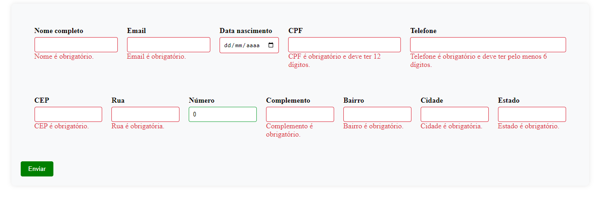

# Projeto de Formulário Angular com Busca de CEP

## Índice

1. [Objetivo](#objetivo)
2. [Descrição do Projeto](#descricao-do-projeto)
3. [Requisitos](#requisitos)
4. [Como Baixar e Rodar o Projeto](#como-baixar-e-rodar-o-projeto)
5. [Imagens](#imagens)

## Objetivo <a name="objetivo"></a>

Desenvolver um formulário em Angular que coleta informações pessoais e de endereço de um usuário. O formulário deve ser esteticamente agradável e seguir as melhores práticas de desenvolvimento de software.

## Descrição do Projeto <a name="descricao-do-projeto"></a>

Este projeto consiste na criação de um formulário em Angular que solicita diversas informações pessoais e de endereço de um usuário. O formulário deve ser intuitivo, com validações em todos os campos para garantir a integridade das informações inseridas. Além disso, ao preencher o campo de CEP, o formulário deve buscar automaticamente as informações de endereço e preenchê-las nos campos correspondentes.

## Requisitos <a name="requisitos"></a>

- O formulário deve ser construído usando Angular.
- Ao digitar o CEP, o formulário deve buscar automaticamente as informações de endereço e preenchê-las nos campos correspondentes.
- O formulário deve ter validações para todos os campos, garantindo que as informações inseridas estejam corretas.
- O design do formulário deve ser agradável e intuitivo para o usuário.
- O código deve ser limpo, bem comentado e seguir as melhores práticas de desenvolvimento Angular.

## Como Baixar e Rodar o Projeto <a name="como-baixar-e-rodar-o-projeto"></a>

1. Certifique-se de ter o Angular CLI instalado. Caso não tenha, instale utilizando o seguinte comando:

   ```
   npm install -g @angular/cli
   ```

2. Clone o repositório do projeto do GitHub:

   ```
   git clone https://github.com/Isabelar07/form-user-angular.git
   ```

3. Acesse o diretório do projeto:

   ```
   cd form-user-angular
   ```

4. Instale as dependências do projeto:

   ```
   npm install
   ```

5. Por fim, execute o projeto utilizando o Angular CLI:

   ```
   ng serve
   ```

   ou

   ```
   npm run start
   ```

6. Abra o navegador e acesse o endereço `http://localhost:4200/` para visualizar o formulário.

## Imagens <a name="imagens"></a>




Desenvolvido por Isabela Rocha Silveira RA: 323212503 e Caio Augusto Nogueira Santos RA: 323112932
